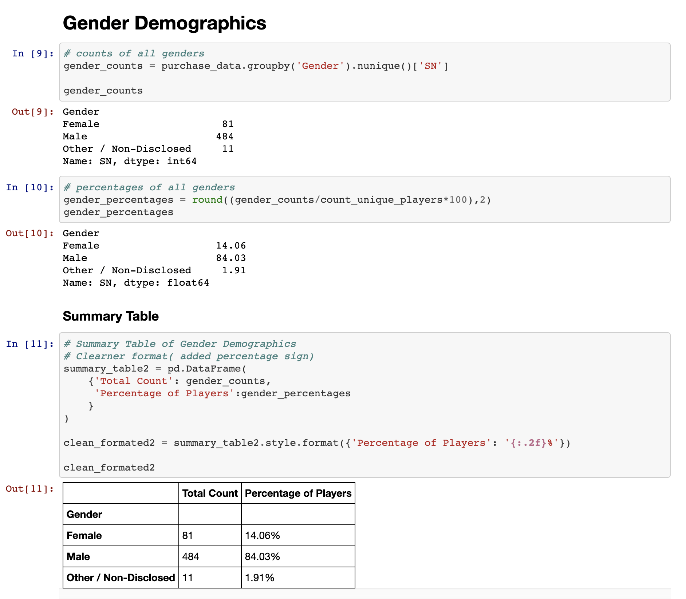
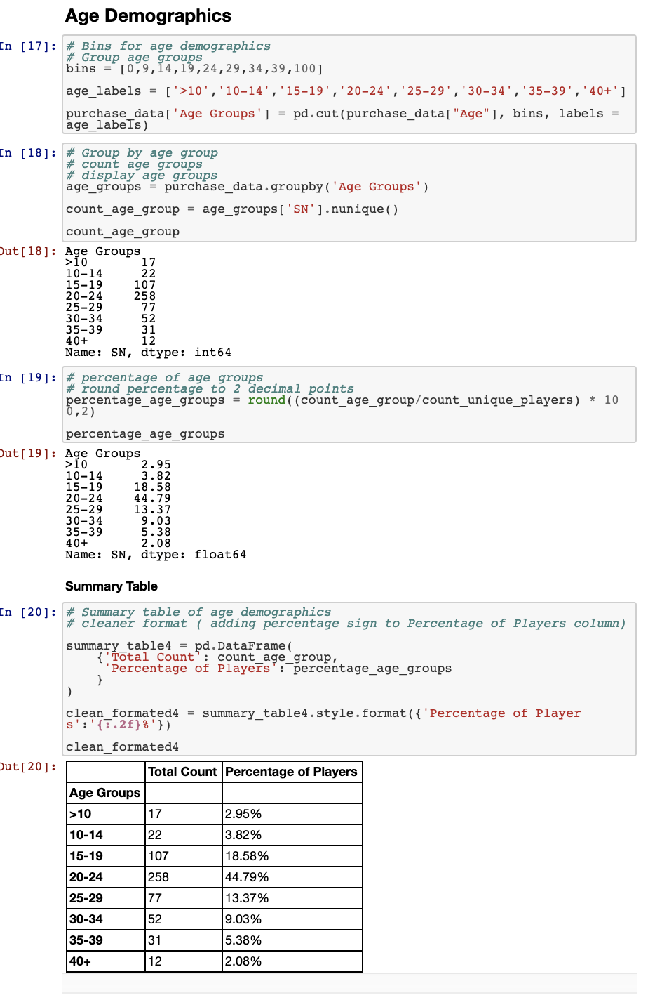
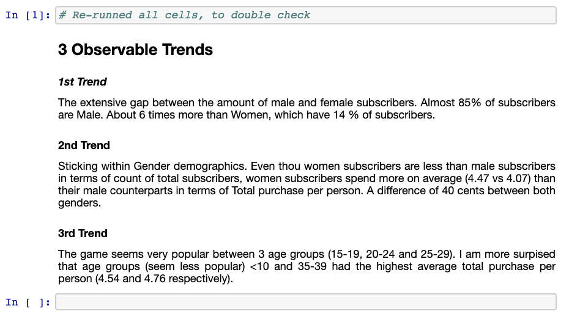

## Overview

Use of Pandas library to analyze gaming purchase data.

## Languages

Python on a Jupyter notebook, with the use of Pandas Library, to create dataframes of the analyzed data.

## Steps

* Import Pandas library to Jupyter notebook. This will allow us to convert the data, once loaded, into a dataframe structure.

* Load CSV file into Jupyter Notebook.

* Converted data file to required dataframes.

* Analyzed data, and converted the analysis into summary tables using dataframes.

* Observable trends were included in the Jupyter notebook as markdown cells.

## Screenshots of Jupyter File

